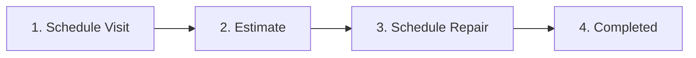

# 📋 Product Requirement Document (PRD) — RAMP

**Product Name:** RAMP (Rental Administration and Maintenance Platform)  
**Target Platform:** Mobile (iOS/Android) & Web (Super Admin Dashboard)  
**Tech Framework:** Flutter 3.47.1 / Dart 3.13.1 (Landlord App) & Next.js/React (Super Admin Web)  
**State Architecture:** `flutter_riverpod` v3.4.3 (Notifier & AsyncNotifier pattern)  
**Document Version:** 2.0.0  
**Status:** Active Production Specification  

---

## 1. Executive Summary & Product Vision

**RAMP (Rental Administration and Maintenance Platform)** is an enterprise-grade property management platform designed exclusively for landlords, property managers, and real estate operators. RAMP streamlines multi-unit rental management by providing a data-dense, real-time operational hub.

### 🎯 Key Product Goals
- **Landlord-Only Account Architecture:** Complete operational control for landlords. Tenants are managed profiles with automated reminder workflows (SMS/Messenger) rather than independent application accounts.
- **Automated Itemized Billing:** Dynamic calculation engine combining Base Rent + Water Submeter Usage (PHP 45.00/m³) + Electricity Submeter Usage (PHP 12.50/kWh) + Late Fees.
- **Staged Maintenance SLA Pipeline:** Enforced 4-stage maintenance workflow (`Schedule Visit` → `Estimate` → `Schedule Repair` → `Completed`) with automated SLA target tracking and tenant notification dispatch.
- **Accurate Financial Ledger:** Clear separation between tenant rent payments and property maintenance expenses, preserving rent balances and computing accurate Net Operating Income (NOI).
- **Offline-First & 0ms Optimistic UI:** Robust offline sync queue (`PendingSyncAction`) guaranteeing uninterrupted productivity in poor connectivity environments.

---

## 2. User Personas & Role-Based Access Control (RBAC)

```
                               ┌────────────────────────────────────────┐
                               │           PLATFORM ECOSYSTEM           │
                               └───────────────────┬────────────────────┘
                                                   │
                   ┌───────────────────────────────┴───────────────────────────────┐
                   ▼                                                               ▼
┌─────────────────────────────────────┐                         ┌─────────────────────────────────────┐
│        SUPER ADMIN (WEB APP)        │                         │       LANDLORD (MOBILE / WEB)       │
├─────────────────────────────────────┤                         ├─────────────────────────────────────┤
│ - Manage Landlord Subscriptions     │                         │ - Portfolio & Unit Management       │
│ - Account Onboarding & Suspension   │                         │ - Tenant Directory & Health Tracking│
│ - Global Financial Analytics        │                         │ - Payment Verification & Receipts   │
│ - Platform-wide Audit Logging       │                         │ - Staged Maintenance Workflow       │
└─────────────────────────────────────┘                         └─────────────────────────────────────┘
```

### 2.1 Landlord (Primary Operational User)
- **Mindset:** Desktop/Mobile hybrid operational hub. Needs quick financial visibility, rapid rent verification, and efficient contractor dispatching.
- **Permissions:** Full CRUD access over assigned properties, units, tenant profiles, billing policies, financial ledger entries, maintenance tickets, and announcements.
- **Access Control:** Firebase Authentication + Firestore `landlords/{uid}` security rules validation.

### 2.2 Managed Tenant Profile (Non-Account Entity)
- **Mindset:** Managed directory records under the owning Landlord.
- **Features:** Profile data, lease terms, water/electric meter logs, rent payment ledger, health status tracking, and multi-channel reminder logs (SMS / Messenger).

### 2.3 Super Admin (Platform Owner)
- **Mindset:** SaaS management dashboard (`SUPER_ADMIN_WEB_INTEGRATION_GUIDE.md`).
- **Permissions:** Global landlord account management, tier limits (Basic/Pro/Enterprise), platform revenue analytics, and system audit log inspection.

---

## 3. Core Functional Modules

### 3.1 Property & Unit Management Engine
- **Unit Hierarchy:** Properties divided into units (`UnitData`) with metadata: Title, Unit Number, Floor, Monthly Base Rent, Due Day, Late Fee, Dimensions (sqm), Bedrooms, Bathrooms, and Amenities.
- **Unit Maintenance Areas:** Configurable maintenance areas per unit (default areas: *Bathroom, Bedroom, Indoor Area, Outdoor Area*). Landlords can add, rename, or remove areas. Ticket creation is restricted to configured unit areas.
- **Submeter Utility Tracking:**
  - Water Usage: `(Current Reading - Previous Reading) * PHP 45.00`
  - Electric Usage: `(Current Reading - Previous Reading) * PHP 12.50`
- **Unit Occupancy Statuses:** `Vacant`, `Occupied`, `Under Maintenance`.

### 3.2 Tenant Directory & Health Engine
- **Tenant Profile Schema:** Name, Phone, Messenger/Facebook Profile link, Lease Start/End dates, Assigned Unit ID, Monthly Rent, and Current Unpaid Balance.
- **Tenant Health Indicator:** Dynamic health evaluation based on payment behavior and reminder frequency:
  - 🟢 **Green:** Pays on or before due date without frequent reminders.
  - 🟡 **Yellow:** Occasional reminders required or upcoming balance due.
  - 🔴 **Red:** Frequently reminded, repeatedly overdue, or severely past due.
- **Multi-Channel Rent Reminders:** Prepared template generation dispatches via SMS or Facebook Messenger. Email actions are completely deprecated. Maintenance reminders are excluded from tenant rent-health calculations.

### 3.3 Financial Ledger & Itemized Billing
- **Payment Recording:** Direct entry supporting payment methods: `GCash`, `Maya`, `Bank Transfer`, and `Cash`.
- **Itemized Ledger Separation:**
  - **Rent Payments:** Credited against tenant unpaid balance.
  - **Maintenance Expenses:** Recorded as `transactionType: 'Maintenance'` linked via `ticketId`. Does **not** modify tenant rent balances. Re-saving ticket estimates upserts the existing maintenance ledger entry to prevent duplicates.
- **Financial Analytics & Reporting:**
  - **Gross Revenue:** Sum of verified rent payments.
  - **Net Operating Income (NOI):** `Gross Revenue - Total Maintenance Expenses`.
  - **Collection Progress:** Real-time percentage of collected rent vs. total monthly expected rent.
  - **Export Engine:** Local PDF and CSV statement generation stored under `RAMP Exports`.

### 3.4 Staged Maintenance SLA Engine
Enforces a strict 4-stage pipeline for property repairs:



1. **Stage 1 — Schedule Visit:** Intake issue name, unit, affected maintenance area, description, date, and visit time slot (Morning/Afternoon/Evening or exact time). Option to prepare tenant visit reminder.
2. **Stage 2 — Estimate:** Record inspection findings, estimated cost amount, and itemized replacement/repair items. Automatically upserts maintenance expense ledger record.
3. **Stage 3 — Schedule Repair:** Assign contractor/repairer, set target repair date and time window. Option to prepare tenant repair reminder.
4. **Stage 4 — Completed:** Provide repair completion summary, before/after photos, and rating feedback (1 to 5 stars).
5. **SLA Targets:** Emergency (24 Hours), Medium (3 Days), Low (7 Days).

### 3.5 AI Property Assistant (Gemini)
- Integrated via `google_generative_ai` (v0.4.7).
- Natural language query bar enabling landlords to ask about portfolio vacancy rates, overdue rent, revenue forecasts, maintenance bottlenecks, and draft tenant communications.

---

## 4. Technical Architecture & Data Schemas

### 4.1 System Technology Stack
- **Framework:** Flutter 3.47.1 & Dart 3.13.1 (Impeller rendering engine)
- **State Management:** `flutter_riverpod` v3.4.3 (`Notifier` / `AsyncNotifier`)
- **Navigation:** `go_router` v18.0.1 (ShellRoutes) / Active tab navigation
- **Backend Infrastructure:** Firebase (Auth, Firestore, Cloud Storage) + Supabase PostgreSQL (`@supabase/supabase-js`)
- **Iconography:** `flutter_svg` with custom Flaticon asset library

### 4.2 Primary Data Schemas (Firestore / Supabase)

#### Landlord Account (`landlords/{landlordId}`)
```typescript
interface LandlordAccount {
  uid: string;
  name: string;
  companyName: string;
  email: string;
  phone: string;
  status: 'active' | 'suspended' | 'pending';
  subscriptionPlan: 'Basic' | 'Pro' | 'Enterprise';
  totalUnitsLimit: number;
  createdAt: string;
  updatedAt: string;
}
```

#### Rental Unit (`units/{unitId}`)
```typescript
interface RentalUnit {
  id: string;
  landlordId: string;
  title: string;
  unitNumber: string;
  floor: string;
  monthlyRent: number;
  rentDueDay: number;
  lateFee: number;
  status: 'Vacant' | 'Occupied' | 'Under Maintenance';
  tenantId?: string;
  maintenanceAreas: string[]; // ["Bathroom", "Bedroom", "Indoor Area", "Outdoor Area"]
  waterReadingCurrent: number;
  electricReadingCurrent: number;
  images: string[];
}
```

#### Tenant Record (`tenants/{tenantId}`)
```typescript
interface TenantRecord {
  id: string;
  landlordId: string;
  name: string;
  phone: string;
  messengerUrl?: string;
  unitId: string;
  monthlyRent: number;
  balance: number;
  leaseStart: string;
  leaseEnd: string;
  dueDate: string;
  healthStatus: 'green' | 'yellow' | 'red';
  isArchived: boolean;
}
```

#### Financial Transaction (`payments/{paymentId}`)
```typescript
interface PaymentRecord {
  id: string;
  landlordId: string;
  unitId: string;
  tenantId?: string;
  amount: number;
  paymentDate: string;
  paymentMethod: 'GCash' | 'Maya' | 'Bank Transfer' | 'Cash';
  referenceNumber: string;
  proofImageUrl?: string;
  transactionType: 'Rent' | 'Maintenance';
  ticketId?: string;
  remarks?: string;
}
```

#### Maintenance Ticket (`tickets/{ticketId}`)
```typescript
interface MaintenanceTicket {
  id: string;
  landlordId: string;
  unitId: string;
  unitArea: string;
  issueDescription: string;
  stage: 'Schedule Visit' | 'Estimate' | 'Schedule Repair' | 'Completed';
  visitSchedule?: { date: string; timeSlot: string; reminderPrepared: boolean };
  estimate?: { amount: number; lineItems: string[] };
  repairSchedule?: { date: string; repairer: string; timeSlot: string; reminderPrepared: boolean };
  completion?: { summary: string; photoAfterUrl?: string; completedAt: string };
  history: Array<{ stage: string; timestamp: string; notes: string }>;
}
```

---

## 5. Non-Functional & Quality Requirements

- **Offline Sync Reliability:** 100% data preservation during offline operation via `PendingSyncAction` persistent queue.
- **UI Performance:** Maintain 60 FPS transitions using Flutter Impeller; zero blocking network calls on the main UI thread.
- **Data Security & Privacy:** Granular Firestore rules ensuring landlords can read/write only their own property partitions (`resource.data.landlordId == request.auth.uid`).
- **Audit Compliance:** System-wide immutable circular buffer logging administrative mutations for compliance tracking.
