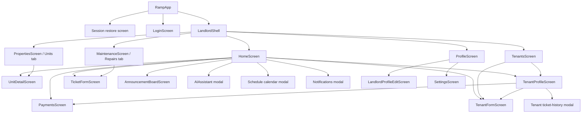

# Page inventory and navigation

## Active navigation tree



## Active full pages

| Page | Source | Entry points | Main exits/actions | Status |
|---|---|---|---|---|
| Session restore | `lib/main.dart` | App startup | Login or landlord shell | Active, transient |
| Login | `lib/screens/login_screen.dart` | No authenticated user | Sign in, reset password | Active |
| Home | `lib/screens/home_screen.dart` | Bottom tab 0 | Payments, units, tenants, repairs, announcements, calendar, AI, notifications | Active |
| Units | `lib/screens/properties_screen.dart` | Bottom tab 1; dashboard links | Unit details; add/edit unit modal | Active |
| Unit details | `lib/screens/unit_detail.dart` | Unit list; calendar; dashboard | Edit unit, utility/rent details, tenant information | Active |
| Tenants | `lib/screens/tenants_screen.dart` | Bottom tab 2; dashboard links | Tenant detail, add/edit tenant, reminder | Active |
| Tenant form | `lib/screens/tenant_form.dart` | Dashboard and tenant list/detail | Create or update tenant, return | Active canonical form |
| Tenant profile | `lib/screens/tenant_profile.dart` | Tenant list; calendar; due cards | Record/view payments, edit tenant, view tickets, send message | Active |
| Repairs | `lib/screens/maintenance_screen.dart` | Bottom tab 3; dashboard links | Ticket details/edit, add ticket, workflow status, rating | Active |
| Ticket form | `lib/screens/ticket_form.dart` | Dashboard, calendar, repairs | Create/update ticket, attach before/after photos | Active canonical form |
| Payments | `lib/screens/payments_screen.dart` | Dashboard, tenant profile, calendar | Record/edit/delete payment, receipt details, filter/search | Active canonical form |
| Profile | `lib/screens/profile_screen.dart` | Bottom tab 4 | Landlord profile implementation | Active wrapper |
| Landlord profile | `lib/screens/profile_landlord.dart` | Profile wrapper | Edit profile, policies, theme, reports, settings, logout | Active |
| Edit landlord profile | `lib/screens/landlord_profile_edit_screen.dart` | Landlord profile | Save/cancel | Active |
| Announcements | `lib/screens/announcement_board_screen.dart` | Dashboard | Add/edit/archive/restore announcement | Active |
| Settings | `lib/features/settings/settings_screen.dart` | Profile | Notification, biometric, security preferences | Active |

## Active modals and sheets

| Modal/sheet | Owner | Purpose |
|---|---|---|
| Schedule calendar | Home | Date-based rent and maintenance events with exact-detail actions |
| Notifications | Home | Read, archive, restore, and action notifications |
| RAMP AI assistant | Home | Query current property state through preset/hardcoded logic |
| Announcement editor | Home/Announcements | Create or edit an announcement |
| Payment form | Payments | Canonical tenant-specific payment entry |
| Payment receipt | Payments | Exact payment breakdown and reference details |
| Tenant reminder | Tenants | Compose/copy a rent reminder |
| Tenant record | Tenants | Expanded tenant information and actions |
| Tenant tickets | Tenant profile | Ticket history for the selected tenant |
| Unit add/edit and policy sheets | Units/Unit details | Unit details, rent policy, readings, images |
| Ticket workflow and rating dialogs | Repairs | Advance status or rate completed work |
| Profile policy/report/settings dialogs | Landlord profile | Configure defaults and export/report actions |

## Alternate GoRouter/drawer tree

This tree is defined in `lib/core/navigation/app_router.dart`, but `RampApp` uses `MaterialApp(home: ...)` and does not use `MaterialApp.router(routerConfig: appRouter)`. These pages are therefore not reached through this router in the active app.

```mermaid
flowchart TD
    ROUTER[Unused appRouter] --> DRAWER[RampDrawerScaffold]
    DRAWER --> DASH[/dashboard → HomeScreen]
    DRAWER --> U[/units → PropertiesScreen]
    DRAWER --> UD[/units/:id → UnitDetailScreen]
    DRAWER --> P[/payments → PaymentQueueScreen]
    DRAWER --> PS[/payments/submit → SubmitPaymentScreen]
    DRAWER --> PV[/payments/verify → PaymentQueueScreen]
    DRAWER --> M[/maintenance → MaintenanceScreen]
    DRAWER --> MS[/maintenance/submit → SubmitTicketScreen]
    DRAWER --> T[/tenants → TenantsScreen]
    DRAWER --> PR[/profile → ProfileScreen]
    DRAWER --> SEC[/security → Placeholder page]
    DRAWER --> SET[/settings → SettingsScreen]
    DRAWER --> HELP[/help → HelpCenterScreen]
```

## Alternate or unreachable pages

| Page | Source | Current condition |
|---|---|---|
| Tenant home | `lib/screens/tenant_home.dart` | Exported but authentication always restores/signs in as landlord |
| Tenant profile/settings UI | `lib/screens/profile_tenant.dart` | Implemented but not selected by `ProfileScreen` |
| Submit payment | `lib/features/payments/submit_payment_screen.dart` | Alternate router only; duplicates active payment flow |
| Payment verification queue | `lib/features/payments/payment_queue_screen.dart` | Alternate router only; uses the newer `PaymentItem` state family |
| Submit maintenance ticket | `lib/features/tickets/submit_ticket_screen.dart` | Alternate router only; duplicates active ticket form |
| Help center | `lib/features/help/help_center_screen.dart` | Alternate router only |
| Security access logs | Placeholder in `app_router.dart` | Alternate router only and not implemented |
| Drawer scaffold/sidebar | `lib/features/navigation/*`, `lib/core/navigation/sidebar_menu.dart` | Alternate router only |
| Feature home widgets | `lib/features/home/widgets/*` | Component set for the alternate architecture; not used by active HomeScreen |
