# Process flowcharts

## Authentication and session restoration

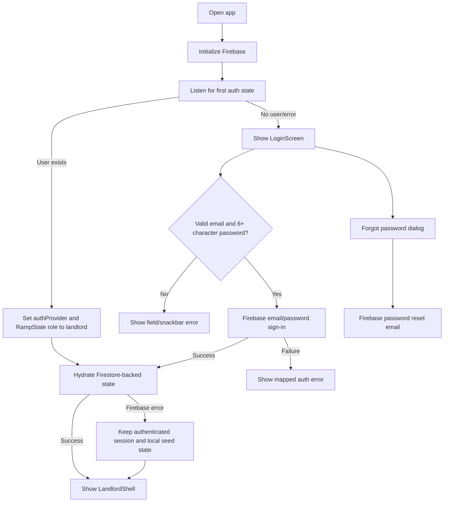

## Main navigation

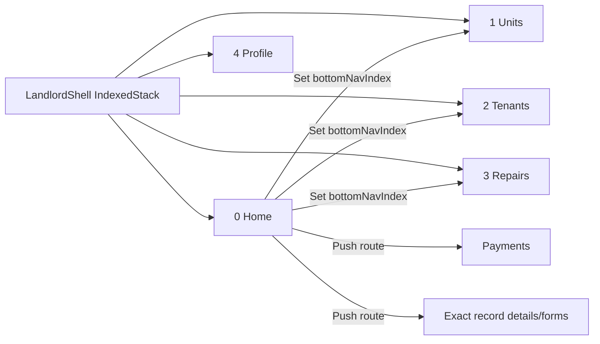

## Dashboard and calendar

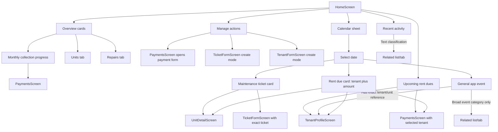

## Payment recording and tenant balance

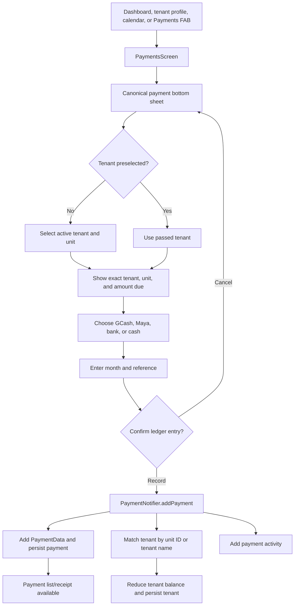

## Payment review, edit, deletion, and receipt

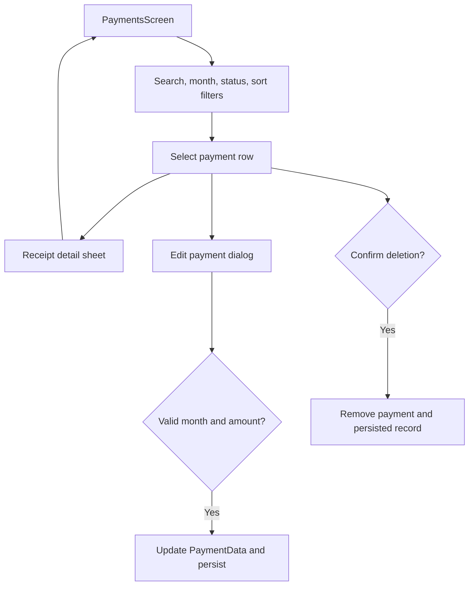

## Tenant lifecycle

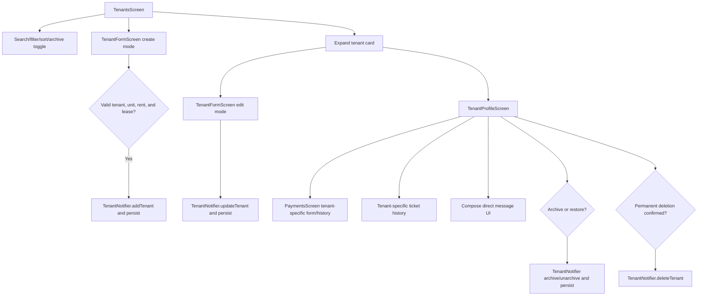

## Unit lifecycle and billing policy

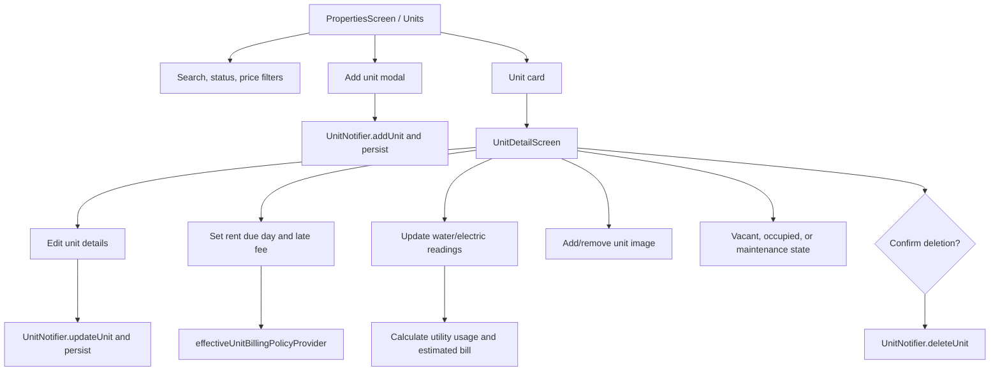

## Maintenance lifecycle

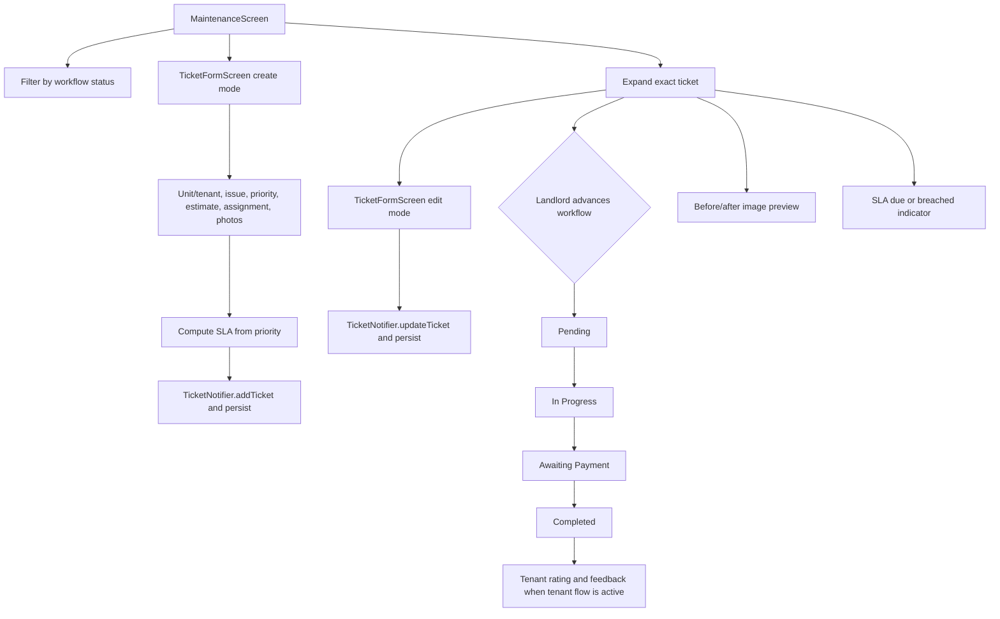

## Announcements

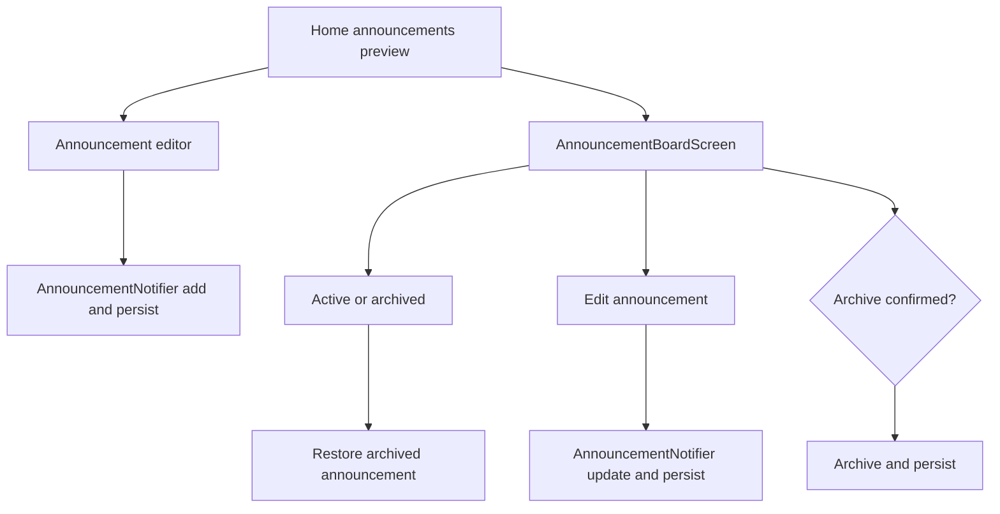

## Notifications

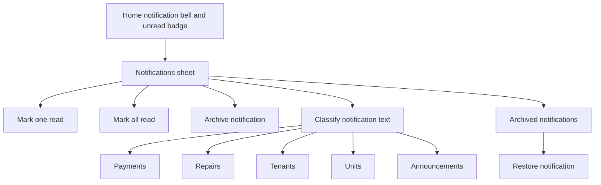

## Profile, settings, and logout

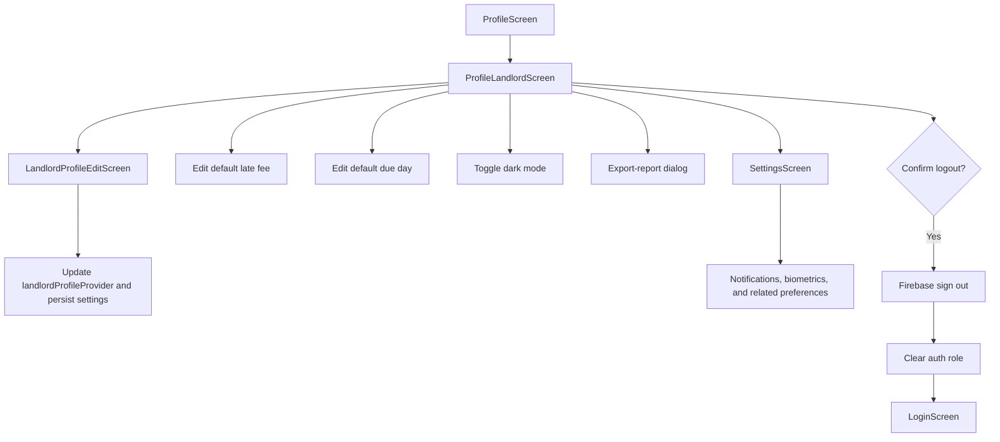

## AI assistant

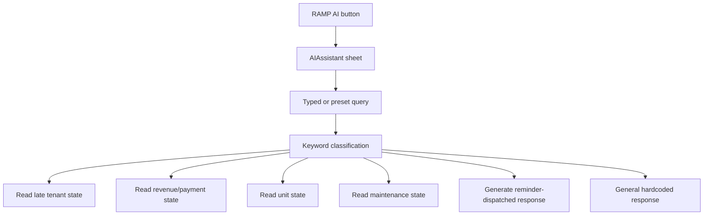
