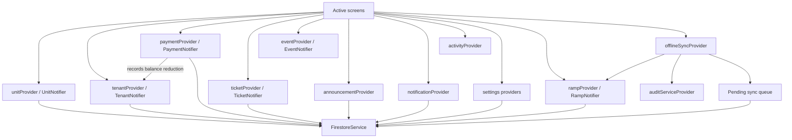
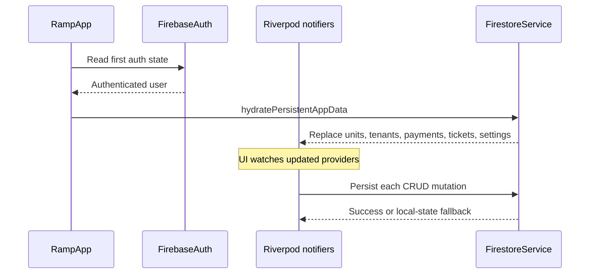

# State and data connections

## Active state topology

## Provider-to-page matrix

| State/provider | Main consumers | Mutations |
|---|---|---|
| `authProvider` | App root, login, role-aware screens, logout | Sign in/out and role selection |
| `bottomNavIndexProvider` | Landlord shell, Home shortcuts | Select one of five active tabs |
| `unitProvider` | Home, Units, Unit details, tenant/payment/ticket forms | Add, update, delete, readings, policies |
| `tenantProvider` | Home, Tenants, Tenant profile, Payments, Repairs | Add, update, archive, restore, delete, record payment |
| `paymentProvider` | Home monthly collection, Payments, Tenant profile, AI | Add, update, delete payment |
| `ticketProvider` | Home calendar, Repairs, Tenant profile, AI | Add, update, delete/workflow/rating |
| `eventProvider` | Home calendar | Add/remove general events |
| `announcementProvider` | Home, Announcement board | Add, update, archive, restore |
| `notificationProvider` | Home notification surfaces | Read, archive, restore |
| `activityProvider` | Home recent activity, AI context | Append activity records |
| `darkModeProvider` | App root, profile/settings | Toggle and persist theme |
| `dueDateDayProvider` | Profile, billing, payment late-fee logic | Update default due day |
| `lateFeeAmountProvider` | Profile, unit/payment policy | Update default late fee |
| `rampProvider` | Session hydration and alternate `PaymentItem`/unit/ticket state | Broad application snapshot CRUD |
| `offlineSyncProvider` | Alternate payment/ticket workflow | Optimistic action queue and flush |

## Payment consistency boundary

`PaymentNotifier.addPayment` is the central write boundary for the active payment flow. It now:

1. Applies payment/late-fee logic.
2. Inserts and persists the `PaymentData` record.
3. Resolves the matching tenant by unit ID or tenant name.
4. Reduces and persists the tenant balance.
5. Appends an activity record.

Keeping this logic in the notifier prevents individual pages from updating the payment ledger without updating the tenant balance.

## Persistence flow

## Two model families currently coexist

| Active/legacy family | Alternate/newer family | Consequence |
|---|---|---|
| `Unit` | `RentalUnitItem` | Mapping/hydration logic is required |
| `Tenant` | Tenant references embedded in newer records | Some flows match by name/unit rather than a common tenant ID |
| `PaymentData` | `PaymentItem` and mock `PaymentRecord` | Separate screens can show different payment collections |
| `Ticket` | `MaintenanceTicketItem` and mock `MaintenanceTicket` | Active and alternate maintenance screens may not share updates |
| `ActivityLog` | `ActivityItem` | Recent activity routing lacks a universal target ID |

This dual model layer is the main data-level source of stale or disconnected UI.
