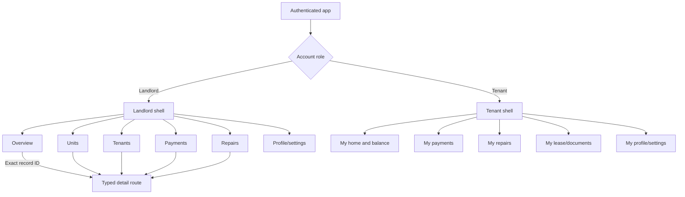

# Flow audit and change opportunities

## Highest-priority architecture issues

| Priority | Finding | Evidence/impact | Recommended change |
|---|---|---|---|
| Critical | Two navigation architectures coexist | `main.dart` launches a five-tab `MaterialApp`; `app_router.dart` defines an unused drawer/GoRouter application | Choose one shell. Convert active routes to GoRouter or remove the unused router/drawer tree after migrating any needed Settings/Help pages. |
| Critical | Multiple state/model families represent the same records | `PaymentData`, `PaymentItem`, and mock `PaymentRecord`; equivalent duplication for units/tickets/activity | Define one canonical domain model per entity and adapt Firestore/mock sources at repository boundaries. |
| High | Tenant role is implemented but unreachable from authentication | Session restore and login always assign `landlord`; `TenantHomeScreen` and `ProfileTenantScreen` are not selected | Store role in authenticated user claims/profile, then route landlord and tenant into separate shells. |
| High | Alternate payment and ticket pages can diverge from active pages | `SubmitPaymentScreen`, `PaymentQueueScreen`, and `SubmitTicketScreen` operate on the alternate state family | Migrate required verification features into the active canonical screens, then remove duplicate pages. |
| High | Recent activity and notification routing is text-based | Home classifies strings such as “payment” or “maintenance” and opens a broad list | Add `entityType` and `entityId` to activity/notification records and route to exact details. |
| High | Security page is only a placeholder | `/security` exists only in the unused router | Either implement a real audit-log screen backed by `auditServiceProvider` or remove the navigation promise. |

## Active-flow issues

| Area | Current behavior | What can improve |
|---|---|---|
| Home density | Home owns calendar, notifications, announcements, AI launch, dues, activities, and overview in one large file | Extract sections into widgets with typed callbacks; keep navigation decisions in one coordinator/service. |
| Navigation | Tab selection and pushed `MaterialPageRoute`s are mixed | Introduce named typed destinations and a single navigation API. |
| Calendar general events | Exact tenant/ticket links work when IDs exist; category-only events still open broad lists | Require entity references for actionable event types or label broad actions clearly as “View all repairs/units.” |
| Payments | Tenant selection is now canonical, but payment identity still has no tenant ID | Add `tenantId` to `PaymentData`; stop relying on tenant-name matching. |
| Payment amount | The active form records the current tenant balance or monthly rent | Add an editable amount with clear rent/utility/late-fee breakdown and partial-payment behavior. |
| Payment status | Landlord form records entries as paid immediately | If proof verification is required, use Pending → Verified/Declined states in the same screen. |
| Tenant communication | “Send SMS” shows a success message but does not connect to an SMS provider | Rename to “Copy message” until an integration exists, or implement a real message service. |
| Reports | Export-report UI is present without a durable exported artifact flow | Generate a real PDF/CSV, show its location, and add sharing/download behavior. |
| AI assistant | UI implies an AI system, while most answers are keyword/hardcoded state summaries | Label it as a preview or connect it through a protected backend before production use. |
| Settings | Settings is accessible from Profile, while the unused drawer also routes to it | Keep the active Profile entry and remove the duplicate router entry when consolidating navigation. |
| Empty data | Several forms historically assumed the first unit/tenant existed | Continue replacing `.first` fallbacks with explicit empty states and disabled submission. |

## Recommended target navigation



## Recommended target entity links

Every actionable cross-feature record should carry explicit identity fields:

```text
Activity/Notification/Event
  entityType: payment | tenant | unit | ticket | announcement
  entityId: stable record ID
  action: view | edit | verify | remind
```

This replaces fragile keyword checks and guarantees that “View details” opens one specific record.

## Suggested implementation order

1. Add stable `tenantId` to payments and explicit target IDs to activities, notifications, and events.
2. Introduce typed app destinations and move all navigation through one service/router.
3. Decide whether the five-tab shell or GoRouter drawer is the product shell; remove the other after migration.
4. Merge `PaymentData`/`PaymentItem`, `Ticket`/`MaintenanceTicketItem`, and `Unit`/`RentalUnitItem` into single domain models.
5. Implement role-aware authentication and connect the existing tenant pages.
6. Merge payment submission and verification into one status-driven payment workflow.
7. Replace simulated SMS, report, security, and AI actions with real integrations or clearly labeled preview behavior.
8. Break Home into independently tested sections and add navigation tests for every cross-page action.

## Definition of a consistent flow

A flow is considered consistent when:

- There is one canonical form for creating or editing each entity.
- A detail action opens a record by stable ID.
- A mutation updates one canonical provider/repository.
- The same record appears updated on Home, list, and detail views without manual refresh.
- Empty data produces an intentional empty state instead of a fallback identity.
- Buttons describe the real action performed.
- Every visible feature is reachable, implemented, and backed by the same state family.
