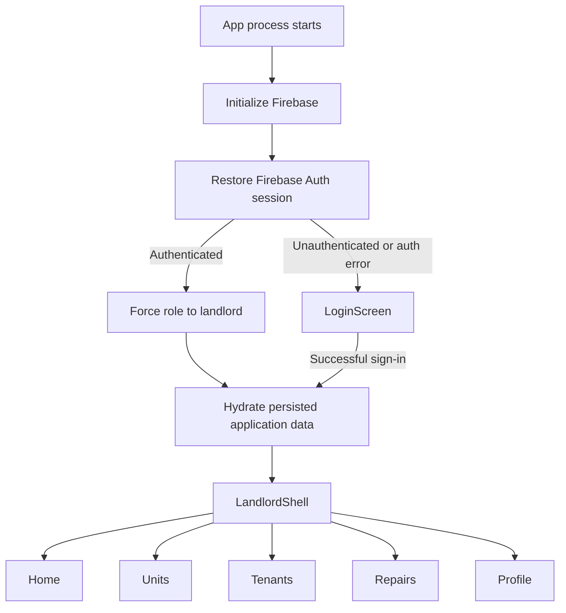

# RAMP application flow documentation

This folder maps every page and major process currently present in the RAMP codebase. Mermaid diagrams render in GitHub, GitLab, many Markdown previewers, and IDE Mermaid plugins.

The diagrams distinguish between:

- **Active:** reachable from the application launched by `lib/main.dart`.
- **Conditional:** implemented and reachable only when a particular record, role, or action is available.
- **Alternate:** belongs to the separate GoRouter/drawer architecture in `lib/core/navigation/app_router.dart`, which is not connected to the active `MaterialApp`.
- **Unreachable:** implemented but has no route from the active application.
- **Modal:** dialog or bottom sheet rather than a full page.

## Documents

1. [Page inventory and navigation](01-page-inventory.md) lists every screen and shows how pages connect.
2. [Process flowcharts](02-process-flowcharts.md) covers authentication, payments, tenants, units, maintenance, calendar, announcements, notifications, profile settings, persistence, and offline synchronization.
3. [State and data connections](03-state-and-data.md) shows which providers and persistence systems drive each feature.
4. [Flow audit and change opportunities](04-flow-audit.md) identifies inconsistent, duplicate, unreachable, or overly broad flows and suggests concrete changes.

## Current application entry point

## How to use this audit

Follow a user goal in `02-process-flowcharts.md`, then compare every transition with `04-flow-audit.md`. A transition marked as broad, alternate, or unreachable is a candidate for redesign. When a flow changes, update the page inventory first and then the affected process diagram.
